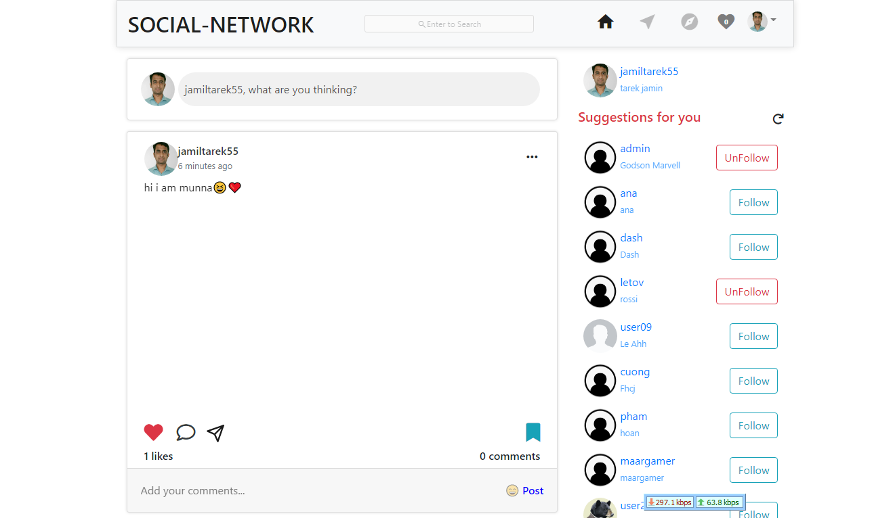
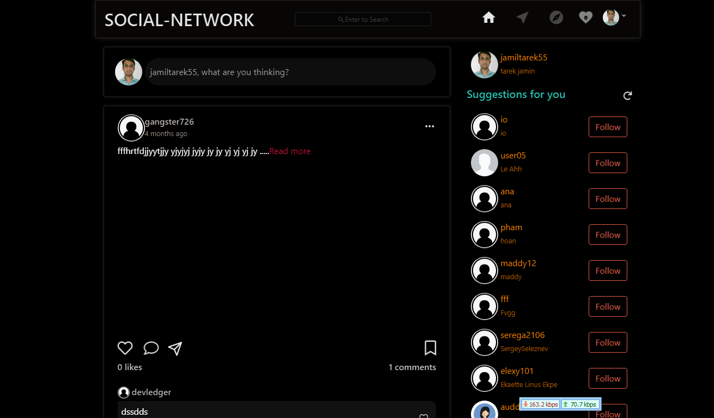
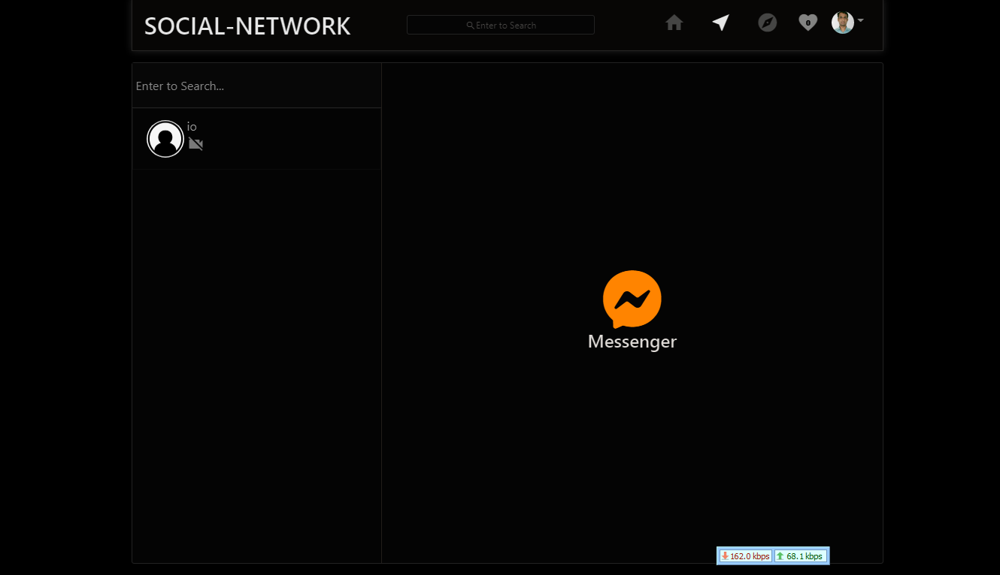
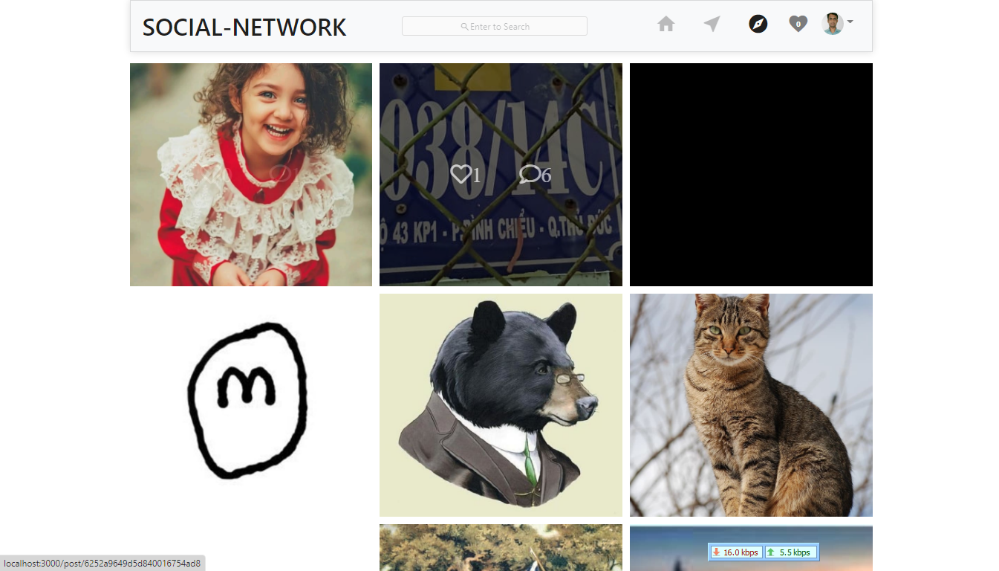
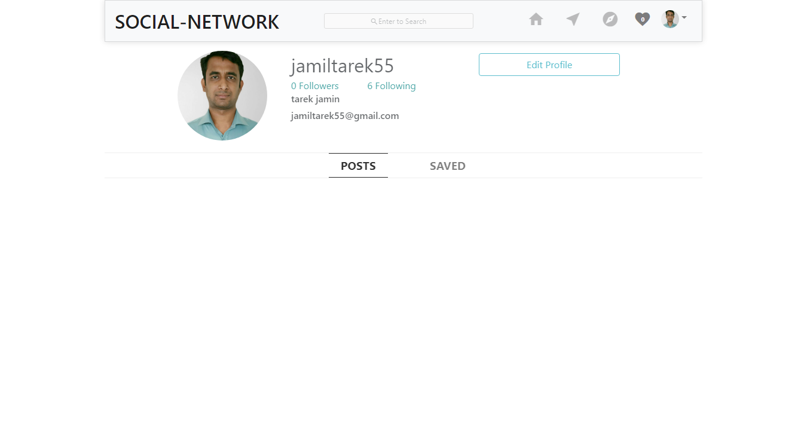
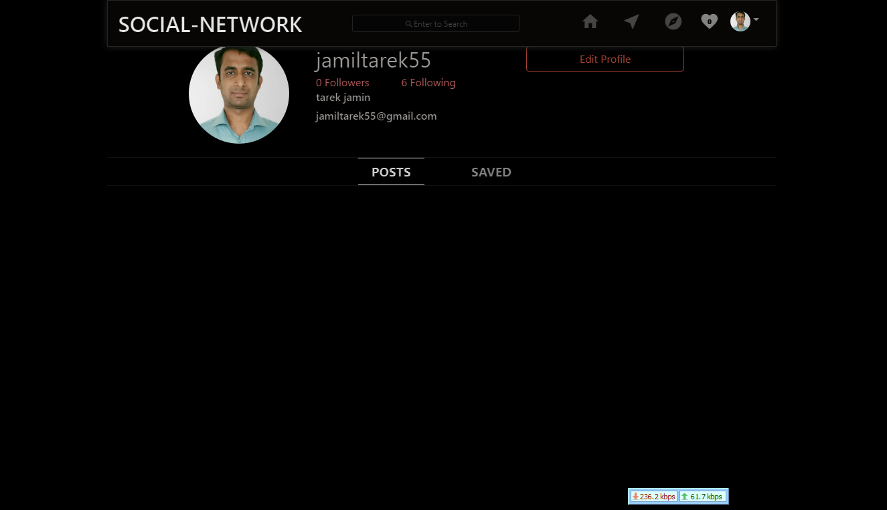

# Welcome MERN Social media application ✉️💬👾📺

**SPA Social media application ✉️ 📞 with video and audio calls.**  Social network 🌍 application model. You can share photos and videos 🤳📷. Write messages in real time 💬⏱️. View the feed of people 🧑‍🤝‍🧑  you are interested in.  <a href="https://frozen-woodland-04787.herokuapp.com/" target="_blank"/> :link:Online demo link:link:<a/>
## ⚙️ General Info

 - Node.js, express.js
 - React, React-router-dom
 - Redux, react-redux, redux-thunk
 -  Socket. io, peer
### App Installation And Running Process
To get a local copy up and running follow these simple example steps.
- Download the Zip file and Extract it on you machine
- goto project directory which is Social_Network
- Or
- Open terminal
- Clone this project by the command:

`$ git clone https://github.com/jamiltarek55/Social_Network.git`

- Then go to the main folder using the next command:

`$ cd Social_Network`

- Then run the next command to install all dependencies:

`$ npm install ` or 
`$ yarn `

- Finally, run the next command in the terminal to see the web app in your local browser, or also, you can use Live Server in Visual Studio Code.
  for server running 

`$ npm start` or 
`$ yarn start`

for client runnig go to client folder by type `cd client`and then type 

`$ npm start` or 
`$ yarn start`

For Concurrently Running both server and client  do as follow

`$ npm run dev` or 
`$ yarn dev` 

### Run tests

- If you want to run our tests, use the next command.

` $ npm test ` or 
`$ yarn test`
 
 
## 🔥 About project 👀

**Homepage** 🏠

    
    Z

  
**Messages and Calls** ✉️ 📞

    
    Z

   
**photos**
 

    
    Z

  
**profile** 🛠️ + 🐬  = 🦈
 

    
    Z

   
**You need login or register to see...** 🔒

